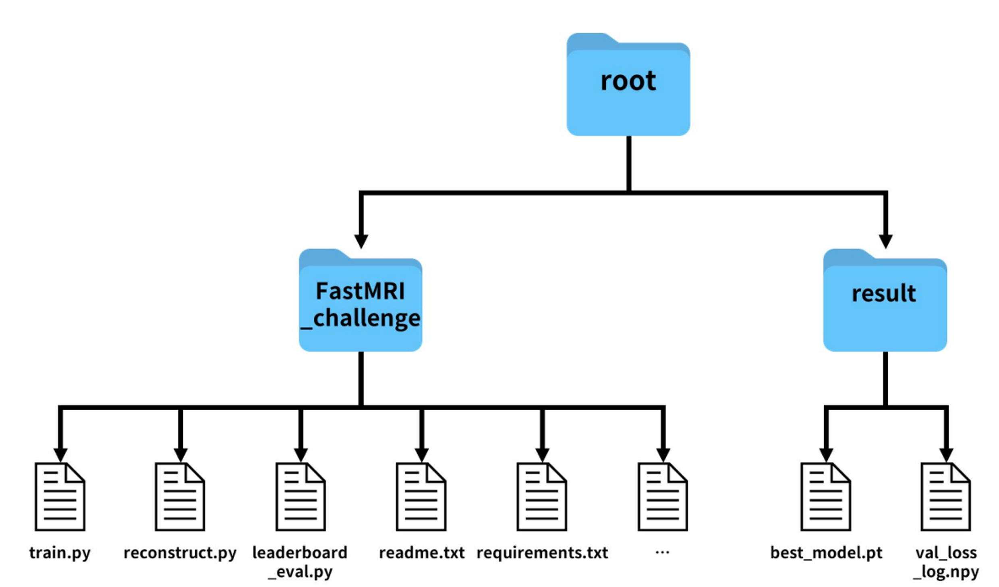

# 2025 SNU FastMRI Challenge | Team NeuroScope

## Competition Overview
[2025 SNU FastMRI challenge](https://fastmri.snu.ac.kr/) is a challenge hosted by Professor [Jong-Ho Lee](https://ece.snu.ac.kr/research-faculty/faculty/full-time?md=view&profid=p077)’s [LIST lab](https://list.snu.ac.kr/home) at Seoul National University. This competition is based on [Facebook AI's FastMRI challenge](https://web.archive.org/web/20230324102125mp_/https://fastmri.org/leaderboards), but with different conditions. Below are the new conditions added by SNU FastMRI Challenge.
- NVIDIA GTX 1080, 8GB VRAM
- Datasets
    - data type : multi-coil kspace and image data of brain, knee
    - acceleration : X4, X8
    - Dataset size
        - Train : 85 sets for each acc-anatomy pair
        - Validation : 15 sets for each acc-anatomy pair
    - Private leaderboard dataset : (not revealed)
        - The top teams on the leaderboard will be tested on the test dataset to determine the final rankings.
- Cannot use pretrained model weights.
- Limited inference time (3,600 seconds)


## What is FastMRI?
FastMRI is accelerating the speed of MRI scanning by acquiring fewer measurements. This may reduce medical costs per patient and improve patients' experience. However, its resolution is very low, so deep learning technology is widely applied to enhance the resolution of FastMRI. In this challenge, we aim to develop a model that can reconstruct images from undersampled measurements in FastMRI.


## Team NeuroScope
We participated in the 2025 SNU FastMRI Challenge as a two-person team named **NeuroScope**.

### Members
- Yechan Choi
    - Undergraduate in the Department of Mechanical Engineering, Seoul National University
    - Email : hhawkk0909@snu.ac.kr
    - Resume : [Yechan Choi](https://yechdn.github.io/)
- Hyeonseop Shin
    - Undergraduate in the Department of Electrical and Computer Engineering, Seoul National University
    - Email : hyeonseop.shin@snu.ac.kr, hysp.shin@gmail.com
    - Resume : [Hyeonseop Shin](https://lake-cartwheel-cf3.notion.site/Hyeonseop-Shin-1b157de522ad805c9c85f573ad94a579)


## Our Model
Our model uses MoE strategy with four [Feature-Image (FI) VarNet](https://www.nature.com/articles/s41598-024-59705-0) sub-models. However, due to the 8GB limit on GPU VRAM, we discarded block-wise attention and use layer-wise gradient checkpoint in each FI-VarNet sub-model to save memory.


### MoE Strategy
We created submodels specialized for specific anatomy and acceleration to handle different types of inputs. When an input is received, the classifier calculates its acceleration(X4 or X8) and anatomy type(brain or knee) and forwards it to the submodel specialized for that case. The result is then outputted. If the input’s acceleration is not covered by the ranges of the submodels, it is forwarded to the model with the closest acceleration range.

### Ensemble
We implement a **Multi-Checkpoint Ensemble** strategy to maximize leaderboard performance by combining predictions from different model checkpoints. This approach leverages the diversity across training epochs and folds to improve reconstruction quality and achieve higher SSIM scores.

#### Checkpoint Selection Strategy
- **Epoch-specific Checkpoints**: Utilize checkpoints from different training epochs (e.g., `epoch8_fold4.pt`, `epoch9_fold4.pt`)
- **Fold-specific Checkpoints**: Utilize checkpoints from different training epochs (e.g., `epoch9_fold1.pt`, `epoch9_fold4.pt`)


### Robustness Enhancement
The kspace masks are usually equal-spaced which the masked area comes out with the same interval. We trained a base model for an equal-spaced mask and retrained it with a random mask, which applied with a probability of 0.5. There is no performance degradation, and also expected to enhance robustness. 


### Model Architecture: Feature-Image VarNet
E2E VarNet, the baseline model, is powerful, but some information is lost in the refinement module. This is basically because the data consistency (DC) module performs updates of a tensor in the 2 channel k-space domain while, in the refinement module, the updates are performed in the feature-space where the tensor's channel number increases upto 32. In the feature-space, we can gain high-level features, but most of them are lost in the process of converting the tensor back into the k-space in order to perform DC module update.


Feature-Image (FI) VarNet resolves this problem by making DC module perform updates of a tensor in the feature-space rather than in k-space. Therefore, the tensor retains a large number of feature channels throughout the network’s cascades. The high-level features which is lost in E2EVarNet's refinement modules are now preserved in FI VarNet.

However, we abandoned Block-wise attention module in FI VarNet due to the 8GB limit on GPU VRAM. The role of attention is to reduce computational complexity while enhancing the model’s ability to identify spatial locations of aliasing artifacts caused by Cartesian undersampling. After experimenting with various hyperparameters, we reached to a conclusion that getting more cascades and deeper UNets is way more efficient in training than maintaining Block-attention module. We believe that the reason block-wise attention did not improve the model’s performance was because the attention block consumed memory, reducing the size of the base model that needed to be maintained. Finally, we adopted 8 feature cascades and 2 image cascades with 32 channels and 8 sensitivity channels.


### Optimizer
We use **AdamW optimizer** with carefully tuned hyperparameters optimized for MRI reconstruction tasks:

- **Optimizer Type**: AdamW (Adam with weight decay)
- **Learning Rate**: `1e-5` (for retrained models) / `3e-4` (for base models)
- **Beta Parameters**: `β₁ = 0.2, β₂ = 0.999` (modified β₁ for faster convergence)
- **Weight Decay**: Built into AdamW optimizer for regularization

The choice of AdamW over standard Adam provides better generalization through decoupled weight decay, which is particularly important for the limited dataset size in FastMRI challenge.

### Scheduler
We implement **multiple learning rate scheduling strategies** to optimize training dynamics:

#### Available Schedulers:
- **Constant Scheduler**: Fixed learning rate (used in retrain phases)
- **Cosine Scheduler**: Cosine annealing for smooth learning rate decay
- **Warmup Cosine**: Linear warmup followed by cosine annealing
- **Double Warmup Cosine**: Two-phase warmup with dual cosine annealing periods

#### Current Configuration:
- **Retrain Phase**: `constant` scheduler with `lr=1e-5`
- **Base Training**: `cosine` scheduler with `lr=3e-4` → `lr_min=5e-5`

The constant scheduler during retraining ensures stable fine-tuning from pre-trained weights, while cosine scheduling provides optimal convergence for initial training.

### Gradient Checkpointing
We employ **layer-wise gradient checkpointing** to overcome the 8GB VRAM limitation of GTX 1080:

```python
# FIVarNet implementation with gradient checkpointing
def apply_ckpt(fn, *args, use_grad_ckpt=True, **kwargs):
    if use_grad_ckpt:
        return checkpoint(fn, *args, use_reentrant=False)
    else:
        return fn(*args, **kwargs)
```

This technique is crucial for fitting our FI-VarNet architecture within the competition's hardware constraints.

### Gradient Accumulation
We implement **gradient accumulation** to simulate larger batch sizes while staying within memory limits:

#### Configuration:
- **Batch Size**: `1` (per GPU step)
- **Accumulation Steps**: `2` (effective batch size = 2)
- **Update Frequency**: Gradients accumulated over 2 steps, then optimizer step

#### Implementation:
```python
# Gradient accumulation logic
loss = loss / accumulation_step  # Scale loss
loss.backward()                  # Accumulate gradients

if (iter + 1) % accumulation_step == 0:
    optimizer.step()             # Update weights
    optimizer.zero_grad()        # Reset gradients
```

This approach allows us to achieve the benefits of larger batch training while respecting hardware constraints.


## For Reproducibility

Our model contains multiple sources of randomness that need to be controlled for reproducible results. We have implemented comprehensive seed fixing to address **four main sources of randomness**, all fixed to seed **2025**.

### 1. Core Random Number Generators
```python
# utils/common/utils.py - seed_fix(n) function
torch.manual_seed(n)              # PyTorch CPU operations
torch.cuda.manual_seed(n)         # PyTorch GPU operations  
torch.cuda.manual_seed_all(n)     # All PyTorch GPU devices
np.random.seed(n)                 # NumPy random operations
random.seed(n)                    # Python built-in random
```

### 2. PyTorch Deterministic Operations
```python
# Ensure deterministic behavior across runs
torch.backends.cudnn.deterministic = True
torch.backends.cudnn.benchmark = False
os.environ['CUBLAS_WORKSPACE_CONFIG'] = ':4096:8'
torch.use_deterministic_algorithms(True, warn_only=True)
```

### 3. Data Loading and Sampling Randomness
- **Volume Sampling**: Uses seeded `torch.Generator` for deterministic volume ordering
```python
# utils/model/fastmri/data/volume_sampler.py
g = torch.Generator()
g.manual_seed(self.seed + self.epoch)
ordering = torch.randperm(len(self.indices), generator=g)
```

### Usage
Seed fixing is automatically applied during training:
```bash
python train.py --seed 2025  # Default seed value
```

The seed is set at the beginning of each training run and affects all subsequent random operations, ensuring bit-level reproducibility across different runs on the same hardware configuration.


## Loss log analysis
As long as we checked, the loss log was same. So we're going to list some of the beginning of loss log.

### Brain - Acc 4
<details><summary>Train logs</summary>
    Random seed fixed to 2025 for reproducibility  </br>
    Current device: cuda:0  </br>
    Found existing classification files! Skipping classification step...  </br>

    =============== Training for class: acc4-brain ===============  
    Set result dir : /root/fastMRI-2025-NeuroScope/results/fivarnet_f8_i2_attn0_c32_s8_base_acc4/epoch5_fold5_slice1/  acc4-brain-slice0/checkpoints  
    Epoch #  0 =============== fivarnet_f8_i2_attn0_c32_s8_base_acc4__epoch5_fold5_slice1_acc4-brain-slice0 ===============  
    Adjusting learning rate to 0.000300  
    Fold 0/5 for class acc4-brain  
    Epoch = [  0/  5]  Fold = [ 0/ 5]  Iter = [   0/2540]  Loss = 0.00342  Time = 4.0135s  
    Epoch = [  0/  5]  Fold = [ 0/ 5]  Iter = [  10/2540]  Loss = 0.08627  Time = 34.2025s  
    Epoch = [  0/  5]  Fold = [ 0/ 5]  Iter = [  20/2540]  Loss = 0.12776  Time = 34.7069s  
    Epoch = [  0/  5]  Fold = [ 0/ 5]  Iter = [  30/2540]  Loss = 0.07891  Time = 34.4128s  
    Epoch = [  0/  5]  Fold = [ 0/ 5]  Iter = [  40/2540]  Loss = 0.04476  Time = 35.5958s  
    Epoch = [  0/  5]  Fold = [ 0/ 5]  Iter = [  50/2540]  Loss = 0.08323  Time = 35.5713s  
    Epoch = [  0/  5]  Fold = [ 0/ 5]  Iter = [  60/2540]  Loss = 0.05765  Time = 36.0122s  
    Epoch = [  0/  5]  Fold = [ 0/ 5]  Iter = [  70/2540]  Loss = 0.06550  Time = 32.9713s  
    Epoch = [  0/  5]  Fold = [ 0/ 5]  Iter = [  80/2540]  Loss = 0.09808  Time = 35.0242s  
    Epoch = [  0/  5]  Fold = [ 0/ 5]  Iter = [  90/2540]  Loss = 0.05539  Time = 35.0836s  
    Epoch = [  0/  5]  Fold = [ 0/ 5]  Iter = [ 100/2540]  Loss = 0.00322  Time = 34.9912s  
    Epoch = [  0/  5]  Fold = [ 0/ 5]  Iter = [ 110/2540]  Loss = 0.03476  Time = 37.0898s  
    Epoch = [  0/  5]  Fold = [ 0/ 5]  Iter = [ 120/2540]  Loss = 0.00021  Time = 34.7800s  
    Epoch = [  0/  5]  Fold = [ 0/ 5]  Iter = [ 130/2540]  Loss = 0.05567  Time = 35.5177s  
    Epoch = [  0/  5]  Fold = [ 0/ 5]  Iter = [ 140/2540]  Loss = 0.01049  Time = 34.8647s  
    Epoch = [  0/  5]  Fold = [ 0/ 5]  Iter = [ 150/2540]  Loss = 0.06445  Time = 34.4818s  
</details>

### Brain - Acc 8
<details><summary>Train logs</summary>
    Random seed fixed to 2025 for reproducibility  
    Current device: cuda:0  
    Found existing classification files! Skipping classification step...  

    =============== Training for class: acc8-brain ===============  
    Set result dir : /root/fastMRI-2025-NeuroScope/results/fivarnet_f8_i2_attn0_c32_s8_base_acc8/epoch5_fold5_slice1/acc8-brain-slice0/checkpoints  
    Epoch #  0 =============== fivarnet_f8_i2_attn0_c32_s8_base_acc8__epoch5_fold5_slice1_acc8-brain-slice0 ===============  
    Adjusting learning rate to 0.000300  
    Fold 0/5 for class acc8-brain  
    Epoch = [  0/  5]  Fold = [ 0/ 5]  Iter = [   0/2540]  Loss = 0.00429  Time = 4.0444s  
    Epoch = [  0/  5]  Fold = [ 0/ 5]  Iter = [  10/2540]  Loss = 0.11296  Time = 34.3548s  
    Epoch = [  0/  5]  Fold = [ 0/ 5]  Iter = [  20/2540]  Loss = 0.16320  Time = 34.8895s  
    Epoch = [  0/  5]  Fold = [ 0/ 5]  Iter = [  30/2540]  Loss = 0.11476  Time = 34.9683s  
    Epoch = [  0/  5]  Fold = [ 0/ 5]  Iter = [  40/2540]  Loss = 0.07012  Time = 36.0575s  
    Epoch = [  0/  5]  Fold = [ 0/ 5]  Iter = [  50/2540]  Loss = 0.11178  Time = 35.8049s  
    Epoch = [  0/  5]  Fold = [ 0/ 5]  Iter = [  60/2540]  Loss = 0.09214  Time = 36.1983s  
    Epoch = [  0/  5]  Fold = [ 0/ 5]  Iter = [  70/2540]  Loss = 0.10734  Time = 33.1525s  
    Epoch = [  0/  5]  Fold = [ 0/ 5]  Iter = [  80/2540]  Loss = 0.16022  Time = 35.1029s  
    Epoch = [  0/  5]  Fold = [ 0/ 5]  Iter = [  90/2540]  Loss = 0.10021  Time = 35.0232s  
    Epoch = [  0/  5]  Fold = [ 0/ 5]  Iter = [ 100/2540]  Loss = 0.00471  Time = 35.1139s  
    Epoch = [  0/  5]  Fold = [ 0/ 5]  Iter = [ 110/2540]  Loss = 0.07326  Time = 36.7027s  
    Epoch = [  0/  5]  Fold = [ 0/ 5]  Iter = [ 120/2540]  Loss = 0.00027  Time = 34.8493s  
    Epoch = [  0/  5]  Fold = [ 0/ 5]  Iter = [ 130/2540]  Loss = 0.11339  Time = 35.6130s  
    Epoch = [  0/  5]  Fold = [ 0/ 5]  Iter = [ 140/2540]  Loss = 0.01767  Time = 35.0135s  
    Epoch = [  0/  5]  Fold = [ 0/ 5]  Iter = [ 150/2540]  Loss = 0.12673  Time = 34.5729s  
</details>

### Knee - Acc 4
<details><summary>Train logs</summary>
    Random seed fixed to 2025 for reproducibility  </br>
    Current device: cuda:0 </br>
    Found existing classification files! Skipping classification step...  </br>

    =============== Training for class: acc4-knee ===============  
    Set result dir : /root/fastMRI-2025-NeuroScope/results/fivarnet_f8_i2_attn0_c32_s8_base_acc4/epoch5_fold5_slice1/acc4-knee-slice0/checkpoints  
    Epoch #  0 =============== fivarnet_f8_i2_attn0_c32_s8_base_acc4__epoch5_fold5_slice1_acc4-knee-slice0 ===============  
    Adjusting learning rate to 0.000300  
    Fold 0/5 for class acc4-knee  
    Epoch = [  0/  5]  Fold = [ 0/ 5]  Iter = [   0/2112]  Loss = 0.08408  Time = 2.7623s  
    Epoch = [  0/  5]  Fold = [ 0/ 5]  Iter = [  10/2112]  Loss = 0.02810  Time = 27.1520s  
    Epoch = [  0/  5]  Fold = [ 0/ 5]  Iter = [  20/2112]  Loss = 0.39315  Time = 26.3029s  
    Epoch = [  0/  5]  Fold = [ 0/ 5]  Iter = [  30/2112]  Loss = 0.08363  Time = 26.0397s  
    Epoch = [  0/  5]  Fold = [ 0/ 5]  Iter = [  40/2112]  Loss = 0.17902  Time = 26.1604s  
    Epoch = [  0/  5]  Fold = [ 0/ 5]  Iter = [  50/2112]  Loss = 0.02606  Time = 26.6640s  
    Epoch = [  0/  5]  Fold = [ 0/ 5]  Iter = [  60/2112]  Loss = 0.06215  Time = 26.0754s  
    Epoch = [  0/  5]  Fold = [ 0/ 5]  Iter = [  70/2112]  Loss = 0.02894  Time = 26.2540s  
    Epoch = [  0/  5]  Fold = [ 0/ 5]  Iter = [  80/2112]  Loss = 0.08492  Time = 26.4918s  
    Epoch = [  0/  5]  Fold = [ 0/ 5]  Iter = [  90/2112]  Loss = 0.06607  Time = 27.2232s  
    Epoch = [  0/  5]  Fold = [ 0/ 5]  Iter = [ 100/2112]  Loss = 0.04168  Time = 26.2653s  
    Epoch = [  0/  5]  Fold = [ 0/ 5]  Iter = [ 110/2112]  Loss = 0.10889  Time = 26.6374s  
    Epoch = [  0/  5]  Fold = [ 0/ 5]  Iter = [ 120/2112]  Loss = 0.12036  Time = 26.5915s  
    Epoch = [  0/  5]  Fold = [ 0/ 5]  Iter = [ 130/2112]  Loss = 0.05691  Time = 26.2618s  
    Epoch = [  0/  5]  Fold = [ 0/ 5]  Iter = [ 140/2112]  Loss = 0.03560  Time = 26.3414s  
    Epoch = [  0/  5]  Fold = [ 0/ 5]  Iter = [ 150/2112]  Loss = 0.04680  Time = 26.5005s  
</details>


### Knee - Acc 8
<details><summary>Train logs</summary>
    Random seed fixed to 2025 for reproducibility  
    Current device: cuda:0  
    Found existing classification files! Skipping classification step...  

    =============== Training for class: acc8-knee ===============  
    Set result dir : /root/fastMRI-2025-NeuroScope/results/fivarnet_f8_i2_attn0_c32_s8_base_acc8/epoch5_fold5_slice1/  acc8-knee-slice0/checkpoints  
    Epoch #  0 =============== fivarnet_f8_i2_attn0_c32_s8_base_acc8__epoch5_fold5_slice1_acc8-knee-slice0 ===============  
    Adjusting learning rate to 0.000300  
    Fold 0/5 for class acc8-knee  
    Epoch = [  0/  5]  Fold = [ 0/ 5]  Iter = [   0/2112]  Loss = 0.09414  Time = 3.2001s  
    Epoch = [  0/  5]  Fold = [ 0/ 5]  Iter = [  10/2112]  Loss = 0.03683  Time = 28.2447s  
    Epoch = [  0/  5]  Fold = [ 0/ 5]  Iter = [  20/2112]  Loss = 0.43803  Time = 27.2764s  
    Epoch = [  0/  5]  Fold = [ 0/ 5]  Iter = [  30/2112]  Loss = 0.10891  Time = 27.1055s  
    Epoch = [  0/  5]  Fold = [ 0/ 5]  Iter = [  40/2112]  Loss = 0.22119  Time = 27.3140s  
    Epoch = [  0/  5]  Fold = [ 0/ 5]  Iter = [  50/2112]  Loss = 0.03606  Time = 27.8640s  
    Epoch = [  0/  5]  Fold = [ 0/ 5]  Iter = [  60/2112]  Loss = 0.07751  Time = 27.1282s  
    Epoch = [  0/  5]  Fold = [ 0/ 5]  Iter = [  70/2112]  Loss = 0.04160  Time = 27.4612s  
    Epoch = [  0/  5]  Fold = [ 0/ 5]  Iter = [  80/2112]  Loss = 0.11055  Time = 27.7022s  
    Epoch = [  0/  5]  Fold = [ 0/ 5]  Iter = [  90/2112]  Loss = 0.08593  Time = 28.4216s  
    Epoch = [  0/  5]  Fold = [ 0/ 5]  Iter = [ 100/2112]  Loss = 0.05679  Time = 27.4173s  
    Epoch = [  0/  5]  Fold = [ 0/ 5]  Iter = [ 110/2112]  Loss = 0.15225  Time = 27.7448s  
    Epoch = [  0/  5]  Fold = [ 0/ 5]  Iter = [ 120/2112]  Loss = 0.16710  Time = 27.7652s  
    Epoch = [  0/  5]  Fold = [ 0/ 5]  Iter = [ 130/2112]  Loss = 0.08166  Time = 27.4650s  
    Epoch = [  0/  5]  Fold = [ 0/ 5]  Iter = [ 140/2112]  Loss = 0.04980  Time = 27.3813s  
    Epoch = [  0/  5]  Fold = [ 0/ 5]  Iter = [ 150/2112]  Loss = 0.05817  Time = 27.6872s
</details>

## How to run our Model?

### 1. Preparation
- The file structure is exactly the same as the rule guide.


### 2. Build conda environment
- All requiremenets of anaconda environment are in environment.yaml.
- Eexecute followed instruction.
```
    conda create env -f environment.yaml 
```

### 3. Training
- Move to **"/root/FastMRI_challenge"** directory. 
- All train instructions are sequenced in **train.sh** already.
- Execute train.sh at background and the results are saved in **"/root/FastMRI_challenge/results"**.
    - model weights, val_loss log files will saved in that directory.
    - We trained base model and retrain them. The final results are double retrained weights.
- Example command that running process in background is below.
```
    nohup bash train.sh > /dev/null > 2>&1 &
```

### 4. Reconstruction
- Execute **reconstruction.sh** and the reconstructions are saved at **"/root/FastMRI_challenge/reconstructions_leaderboard"**
```
    bash reconstruct.sh
```
- Or you can indicate external leaderboard dataset path with command below.
```
    python reconstruction.py --leaderboard_path <new lb path>
```

### 5. Calculating Leaderboard SSIM
- Execute **leaderboard_eval.py**.
```
    python leaderboard_eval.py --path_your_data /root/FastMRI_challenge/reconstructions_leaderboard --path_leaderboard_data <new lb path>
```