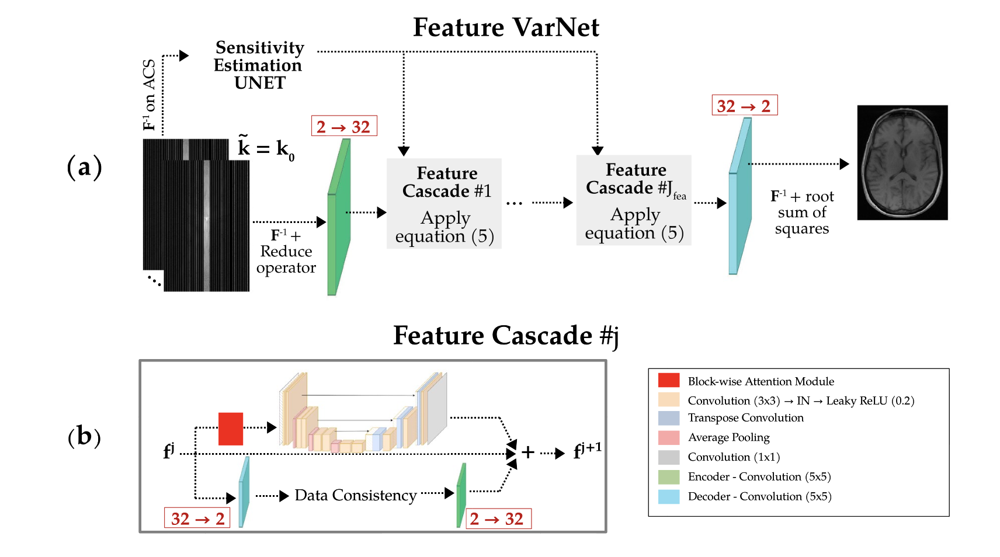
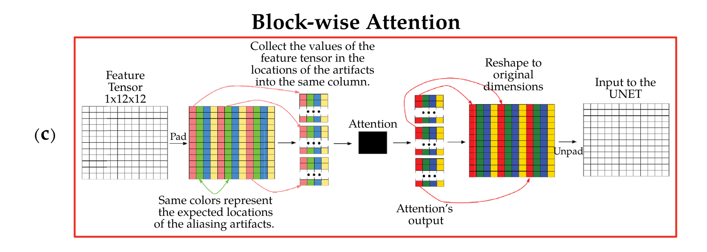
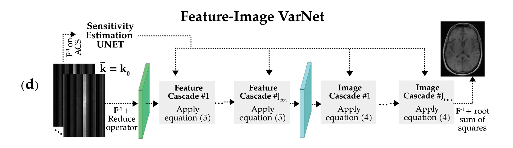

# 2025 SNU FastMRI Challenge | Team NeuroScope
---
## Competition Overview
[2025 SNU FastMRI challenge](https://fastmri.snu.ac.kr/) is a challenge hosted by Professor [Jong-Ho Lee](https://ece.snu.ac.kr/research-faculty/faculty/full-time?md=view&profid=p077)’s [LIST lab](https://list.snu.ac.kr/home) at Seoul National University. This competition is based on [Facebook AI's FastMRI challenge](https://web.archive.org/web/20230324102125mp_/https://fastmri.org/leaderboards), but with different conditions. Below are the new conditions added by SNU FastMRI Challenge.
- NVIDIA GTX 1080, 8GB VRAM
- Datasets
    - data type : multi-coil kspace and image data of brain, knee
    - acceleration : X4, X8
    - Dataset size
        - Train : 85 sets for each acc-anatomy pair
        - Validation : 15 sets for each acc-anatomy pair
    - Private leaderboard dataset : (not revealed)
        - The top teams on the leaderboard will be tested on the test dataset to determine the final rankings.
- Cannot use pretrained model weights.
- Limited inference time (3,600 seconds)


## What is FastMRI?
FastMRI is accelerating the speed of MRI scanning by acquiring fewer measurements. This may reduce medical costs per patient and improve patients' experience. However, its resolution is very low, so deep learning technology is widely applied to enhance the resolution of FastMRI. In this challenge, we aim to develop a model that can reconstruct images from undersampled measurements in FastMRI.


## Team NeuroScope
We participated in the 2025 SNU FastMRI Challenge as a two-person team named **NeuroScope**.

### Members
- Yechan Choi
    - Undergraduate in the Department of Mechanical Engineering, Seoul National University
    - Email : hhawkk0909@snu.ac.kr
    - Resume : [Yechan Choi](https://yechdn.github.io/)
- Hyeonseop Shin
    - Undergraduate in the Department of Electrical and Computer Engineering, Seoul National University
    - Email : hyeonseop.shin@snu.ac.kr, hysp.shin@gmail.com
    - Resume : [Hyeonseop Shin](https://lake-cartwheel-cf3.notion.site/Hyeonseop-Shin-1b157de522ad805c9c85f573ad94a579)

---
## Our Model
Our model uses MoE strategy with four [Feature-Image (FI) VarNet](https://www.nature.com/articles/s41598-024-59705-0) sub-models. However, due to the 8GB limit on GPU VRAM, we discarded block-wise attention and use layer-wise gradient checkpoint in each FI-VarNet sub-model to save memory.


### MoE Strategy
We created submodels specialized for specific anatomy and acceleration to handle different types of inputs. When an input is received, the classifier calculates its acceleration(X4 or X8) and anatomy type(brain or knee) and forwards it to the submodel specialized for that case. The result is then outputted. If the input’s acceleration is not covered by the ranges of the submodels, it is forwarded to the model with the closest acceleration range.

### Ensemble
쓸겁니다~

### Robustness Enhancement
The kspace masks are usually equal-spaced which the masked area comes out with the same interval. We trained a base model for an equal-spaced mask and retrained it with a random mask, which applied with a probability of 0.2. There is no performance degradation, and also expected to enhance robustness. 


### Model Architecture: Feature-Image VarNet
E2E VarNet, the baseline model, is powerful, but some information is lost in the refinement module. This is basically because the data consistency (DC) module performs updates of a tensor in the 2 channel k-space domain while, in the refinement module, the updates are performed in the feature-space where the tensor's channel number increases upto 32. In the feature-space, we can gain high-level features, but most of them are lost in the process of converting the tensor back into the k-space in order to perform DC module update.





Feature-Image (FI) VarNet resolves this problem by making DC module perform updates of a tensor in the feature-space rather than in k-space. Therefore, the tensor retains a large number of feature channels throughout the network’s cascades. The high-level features which is lost in E2EVarNet's refinement modules are now preserved in FI VarNet.

However, we abandoned Block-wise attention module in FI VarNet due to the 8GB limit on GPU VRAM. The role of attention is to reduce computational complexity while enhancing the model’s ability to identify spatial locations of aliasing artifacts caused by Cartesian undersampling. After experimenting with various hyperparameters, we reached to a conclusion that getting more cascades and deeper UNets is way more efficient in training than maintaining Block-attention module. We believe that the reason block-wise attention did not improve the model’s performance was because the attention block consumed memory, reducing the size of the base model that needed to be maintained. Finally, we adopted 8 feature cascades and 2 image cascades with 32 channels and 8 sensitivity channels.

---
## How to run our Model?

### 1. Preparation
- The file structure is exactly the same as the rule guide.


### 2. Build conda environment
- All requiremenets of anaconda environment are in environment.yaml.
- Eexecute followed instruction.
```
    conda create env -f environment.yaml 
```

### 3. Training
- Move to **"/root/FastMRI_challenge"** directory. 
- All train instructions are sequenced in **train.sh** already.
- Execute train.sh at background and the results are saved in **"/root/FastMRI_challenge/results"**.
    - model weights, val_loss log files will saved in that directory.
    - We trained base model and retrain them. The final results are retrained weights.
- Example command is below.
```
    nohup bash train.sh > /dev/null > 2>&1 &
```

### 4. Reconstruction
- Execute **reconstruction.sh** and the reconstructions are saved at **"/root/FastMRI_challenge/reconstructions_leaderboard"**
```
    bash reconstruct.sh
```
- Or you can indicate external leaderboard dataset path with command below.
```
    python reconstruction.py --leaderboard_path <new lb path>
```

### 5. Calculating Leaderboard SSIM
- Execute **leaderboard_eval.py**.
```
    python leaderboard_eval.py --path_your_data /root/FastMRI_challenge/reconstructions_leaderboard --path_leaderboard_data <new lb path>
```